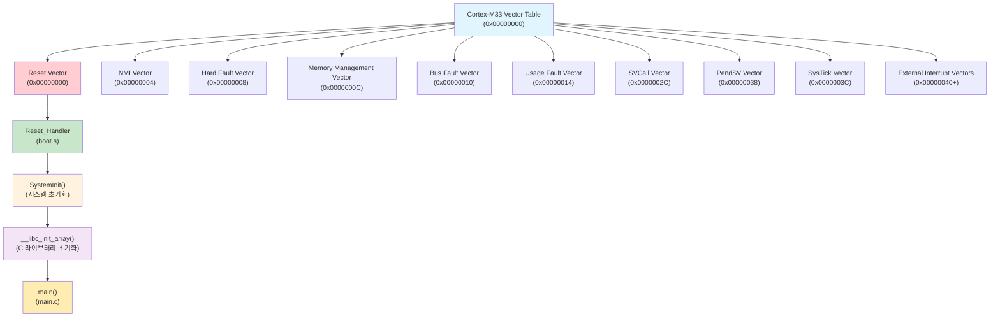
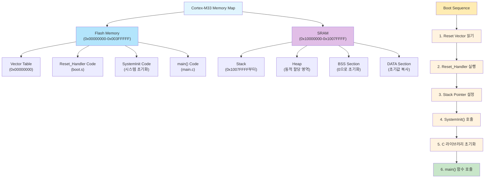
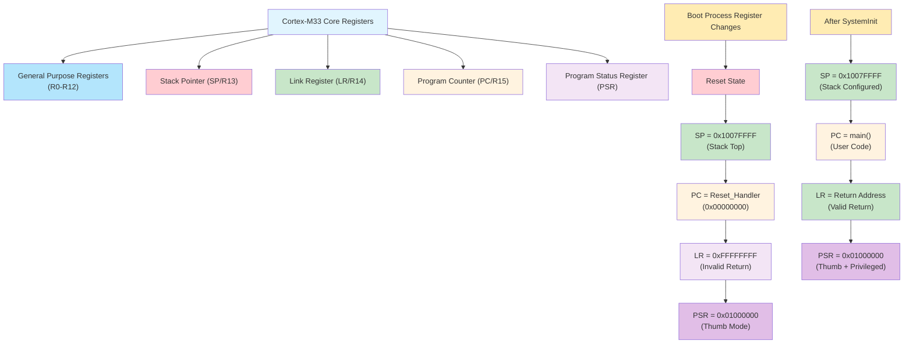

# 1. Main 함수 실행 과정 분석 - GDB로 디버깅하기

이 예제에서는 Cortex-M33 마이크로컨트롤러에서 C 프로그램의 main 함수가 어떻게 실행되는지 GDB를 활용하여 단계별로 분석해보겠습니다.

## 📋 학습 목표

- Cortex-M33 부팅 과정 이해
- 벡터 테이블과 리셋 벡터의 역할
- main 함수에 도달하기까지의 과정
- GDB를 활용한 실시간 디버깅

## 🛠️ 사전 준비

### 1. 프로젝트 빌드
```bash
# 프로젝트 빌드
make clean && make
```

### 2. GDB 디버깅 환경 준비
```bash
# arm-none-eabi-gdb가 설치되어 있는지 확인
arm-none-eabi-gdb --version

# QEMU가 설치되어 있는지 확인
qemu-system-arm --version
```

## 📊 Cortex-M33 부팅 과정 시각화

### 벡터 테이블 구조 다이어그램



### 메모리 맵과 부팅 과정 다이어그램



### 레지스터 상태 변화 다이어그램



## 🔍 코드 분석

### 프로그램 구조
- `src/boot.s`: 부팅 어셈블리 코드 (벡터 테이블, 리셋 핸들러)
- `src/main.c`: C 메인 프로그램
- `linker/cortex-m33.ld`: 링커 스크립트 (메모리 배치)

## 🚀 QEMU에서 실행하며 디버깅

### 1단계: QEMU 시작 및 GDB 연결

```bash
# 터미널 1: QEMU 실행 (GDB 서버 모드)
qemu-system-arm -machine mps2-an505 -cpu cortex-m33 \
    -kernel build/cortex-m33-hello-world.elf \
    -nographic -monitor none -serial stdio -s -S
```

```bash
# 터미널 2: GDB 시작 및 QEMU 연결
arm-none-eabi-gdb build/cortex-m33-hello-world.elf

# GDB 프롬프트에서 실행
(gdb) target remote localhost:1234
(gdb) load
```

**예상 결과:**
```
Remote debugging using localhost:1234
Loading section .text, size 0xa30 lma 0x0
Start address 0x4c, entry point 0x4c
```

### 2단계: 벡터 테이블 분석

```bash
# GDB에서 벡터 테이블 확인 (0x00000000 주소부터)
(gdb) x/8xw 0x00000000
```

**예상 결과:**
```
0x0:    0x2007ffff  0x0000004d  0x00000051  0x00000051
0x10:   0x00000051  0x00000051  0x00000051  0x00000000
```

**벡터 테이블 구조:**
- `0x00000000`: 스택 포인터 초기값 (MSP) = 0x2007ffff
- `0x00000004`: 리셋 벡터 (Reset_Handler 주소) = 0x0000004d

### 3단계: 리셋 핸들러에 브레이크포인트 설정

```bash
# Reset_Handler에 브레이크포인트 설정
(gdb) break Reset_Handler
(gdb) info registers pc sp

# 프로그램 실행 시작
(gdb) continue
```

**예상 결과:**
```
Breakpoint 1 at 0x4c: file src/boot.s, line 25.
pc             0x4c                0x4c <Reset_Handler>
sp             0x2007ffff          0x2007ffff
Continuing.

Breakpoint 1, Reset_Handler () at src/boot.s:25
25          ldr sp, =__StackTop
```

**🔍 레지스터 분석:**
- **PC (Program Counter)**: 0x4c - Reset_Handler 주소
- **SP (Stack Pointer)**: 0x2007ffff - 벡터 테이블에서 설정된 스택 상단

### 4단계: Reset_Handler 코드 분석

```bash
# 현재 어셈블리 코드 확인
(gdb) disassemble
(gdb) stepi    # 어셈블리 명령어 단위로 실행
(gdb) info registers
```

**Reset_Handler의 주요 작업:**
1. 스택 포인터 설정
2. BSS 섹션 초기화 (전역 변수 0으로 초기화)  
3. DATA 섹션 복사 (Flash에서 RAM으로)
4. main 함수 호출

### 5단계: main 함수 진입 추적

```bash
# main 함수에 브레이크포인트 설정
(gdb) break main
(gdb) continue

# main 함수 도달 후 레지스터 상태 확인
(gdb) info registers
(gdb) info frame
```

**🔍 main 함수 진입 시 레지스터 변화:**
- **PC**: main 함수 주소로 변경
- **SP**: 스택 프레임 설정으로 약간 감소
- **LR (Link Register)**: 리턴 주소 저장

### 6단계: main 함수 내부 분석

```bash
# 현재 소스 코드 위치 확인
(gdb) list
(gdb) info locals

# 스택 상태 확인
(gdb) backtrace
(gdb) info frame
```

### 7단계: 함수 호출 추적

```bash
# print_string 함수에 브레이크포인트 설정
(gdb) break print_string
(gdb) step    # 다음 라인으로 이동 (함수 내부 진입)
(gdb) next    # 다음 라인으로 이동 (함수 호출을 한 번에 실행)

# 함수 호출 전후 스택 포인터 변화 관찰
(gdb) print $sp
(gdb) step
(gdb) print $sp
```

**🔍 함수 호출 시 레지스터 변화:**
- **SP**: 함수 호출 시 감소 (스택 프레임 생성)
- **LR**: 호출 지점의 다음 주소 저장
- **PC**: 호출된 함수의 시작 주소로 변경

### 8단계: 세미호스팅 동작 분석

```bash
# semihost_call 함수에서 레지스터 상태 확인
(gdb) break semihost_call
(gdb) continue
(gdb) info registers

# 인라인 어셈블리 코드 분석 (SVC 명령어)
(gdb) stepi
(gdb) disassemble $pc,$pc+8
```

**🔍 세미호스팅 레지스터 사용:**
- **R0**: 세미호스팅 명령어 번호 (예: 0x04 = SYS_WRITE0)
- **R1**: 매개변수 포인터
- **SVC 명령어**: 시스템 서비스 호출로 QEMU가 처리

## 📊 학습 결과 정리

### 부팅 과정 요약

1. **하드웨어 리셋**
   - CPU가 0x00000000 (벡터 테이블 베이스) 주소를 참조
   - MSP(Main Stack Pointer) 초기화
   - Reset_Handler 주소로 점프

2. **Reset_Handler 실행**
   - 스택 포인터 설정 확인
   - BSS 섹션 0으로 초기화
   - DATA 섹션 ROM→RAM 복사
   - main 함수 호출

3. **main 함수 실행**
   - C 런타임 환경 완전 초기화 완료
   - 사용자 프로그램 로직 실행

### 핵심 개념

- **벡터 테이블**: 인터럽트와 예외 처리를 위한 함수 포인터 배열
- **리셋 벡터**: 시스템 부팅 시 실행되는 첫 번째 사용자 코드
- **세미호스팅**: 디버거를 통한 입출력 시뮬레이션

## 🔧 추가 실험

### 1. 브레이크포인트 조작
```bash
# 모든 브레이크포인트 확인
(gdb) info breakpoints

# 브레이크포인트 삭제
(gdb) delete 1    # 브레이크포인트 번호 1 삭제
(gdb) clear       # 현재 위치의 브레이크포인트 삭제
```

### 2. 메모리 덤프
```bash
# 코드 영역 확인 (어셈블리 명령어로)
(gdb) x/10i $pc

# 메모리 내용 확인 (16진수로)
(gdb) x/16xb 0x20000000    # 16바이트를 바이트 단위로 출력
(gdb) x/8xw 0x00000000     # 8워드를 워드 단위로 출력
```

### 3. 변수 관찰
```bash
# 지역 변수 확인
(gdb) info locals
(gdb) info args

# 특정 변수 값 출력
(gdb) print variable_name
(gdb) print/x variable_name    # 16진수로 출력
```

## 🎯 퀴즈

1. Reset_Handler에서 main 함수가 호출되기 전에 어떤 초기화 작업들이 수행되나요?
2. 벡터 테이블의 첫 번째 엔트리는 무엇이고 왜 중요한가요?
3. 세미호스팅은 어떤 방식으로 동작하며, 실제 하드웨어에서는 어떻게 대체되나요?

---

**다음 단계**: [02-memory-layout](../02-memory-layout/) - 메모리 영역과 변수의 이해