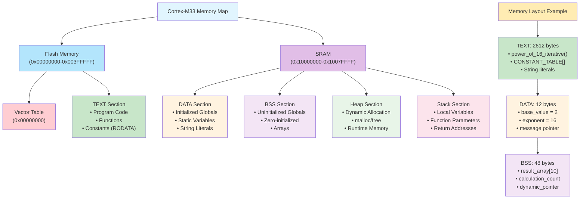
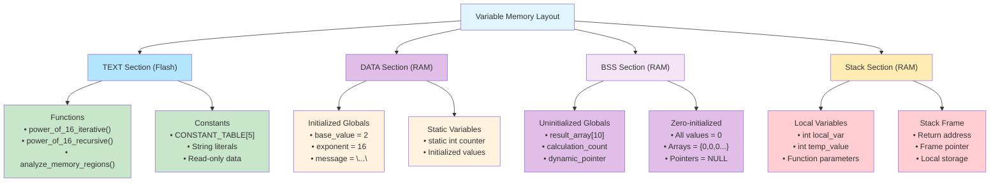
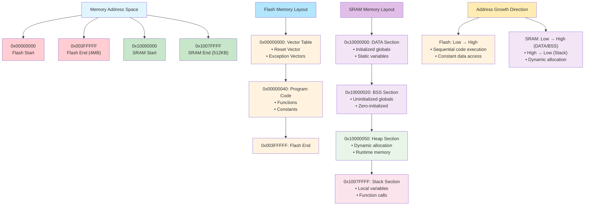

# 2. 메모리 레이아웃 분석 - Text, Data, BSS 영역의 이해

이 예제에서는 Cortex-M33에서 x^16 함수를 구현하면서 메모리의 TEXT, DATA, BSS 영역이 어떻게 구성되고 사용되는지 GDB를 활용하여 분석해보겠습니다.

## 📋 학습 목표

- TEXT, DATA, BSS 메모리 영역의 차이점 이해
- 전역 변수와 지역 변수의 메모리 배치
- 포인터와 메모리 주소의 관계
- 상수 데이터와 읽기 전용 메모리 영역
- 컴파일러가 메모리를 어떻게 배치하는지 이해

## 🛠️ 사전 준비

### 1. 프로젝트 빌드
```bash
make clean && make
```

**빌드 결과 분석:**
```
   text    data     bss     dec     hex filename
   2612      12      48    2672     a70 build/cortex-m33-hello-world.elf
```

- **text (2612 bytes)**: 프로그램 코드 + 상수 데이터
- **data (12 bytes)**: 초기화된 전역 변수
- **bss (48 bytes)**: 초기화되지 않은 전역 변수

### 2. 프로그램 실행으로 메모리 주소 확인
```bash
qemu-system-arm -machine mps2-an505 -cpu cortex-m33 -kernel build/cortex-m33-hello-world.elf -nographic -monitor none -serial stdio -semihosting
```

**수정된 메모리 맵에서 확인되는 메모리 주소:**
- FLASH/TEXT 영역: `0x00000000` ~ `0x003FFFFF` (코드 + 상수)
- RAM/DATA 영역: `0x20000000` ~ (초기화된 전역변수)
- RAM/BSS 영역: DATA 이후 ~ (초기화되지 않은 전역변수)  
- RAM/STACK 영역: `0x2007FFFF`부터 아래로 성장

## 📊 메모리 레이아웃 시각화

### Cortex-M33 메모리 맵 다이어그램



### 메모리 영역별 변수 배치 다이어그램



### 메모리 주소 공간 다이어그램



## 🔍 메모리 영역별 상세 분석

### TEXT 영역 (코드 + 상수)
```c
// 함수 코드 (TEXT 영역)
int power_of_16_iterative(int x) { ... }

// 읽기 전용 상수 (RODATA/TEXT 영역)
const int CONSTANT_TABLE[5] = {1, 2, 4, 8, 16};
```

### DATA 영역 (초기화된 전역 변수)
```c
int base_value = 2;           // 초기값 2로 설정
int exponent = 16;           // 초기값 16으로 설정
const char* message = "..."; // 문자열 포인터
```

### BSS 영역 (초기화되지 않은 전역 변수)
```c
int result_array[10];        // 자동으로 0으로 초기화
int calculation_count;       // 자동으로 0으로 초기화
int* dynamic_pointer;        // 자동으로 NULL로 초기화
```

## 🚀 GDB를 활용한 메모리 분석

### 1단계: QEMU와 GDB 연결

```bash
# 터미널 1: QEMU GDB 서버 모드로 실행
qemu-system-arm -machine mps2-an505 -cpu cortex-m33 \
    -kernel build/cortex-m33-hello-world.elf \
    -nographic -monitor none -serial stdio -semihosting -s -S
```

```bash
# 터미널 2: GDB 시작 및 연결
arm-none-eabi-gdb build/cortex-m33-hello-world.elf

# GDB 프롬프트에서 실행
(gdb) target remote localhost:1234
(gdb) load
```

### 2단계: 메모리 영역 분석

#### DATA 영역 분석
```bash
# 전역 변수 주소 확인
(gdb) print &base_value
(gdb) print base_value

# 여러 전역 변수의 주소 비교
(gdb) print &base_value
(gdb) print &exponent
(gdb) print &message
```

**예상 결과 (수정된 메모리 맵):**
```
&base_value = 0x20000000  (RAM DATA 영역 시작)
base_value = 2 (초기화된 값)
&exponent = 0x20000004    (다음 int 변수)
```

**🔍 DATA 영역 레지스터 분석:**
- 링커가 DATA 영역을 RAM(0x20000000)에 배치
- 초기화된 전역 변수들이 연속적으로 배치
- 부팅 시 Flash에서 RAM으로 복사됨

#### BSS 영역 분석
```bash
# BSS 영역 변수 주소 확인
(gdb) print &result_array
(gdb) print &calculation_count
(gdb) print &dynamic_pointer

# BSS 영역이 0으로 초기화되었는지 확인
(gdb) x/10xw &result_array
(gdb) print result_array[0]
(gdb) print calculation_count
```

**예상 결과:**
```
&result_array = 0x20000010      (DATA 영역 이후)
&calculation_count = 0x20000038  (배열 다음)
result_array[0] = 0             (0으로 초기화)
calculation_count = 0           (0으로 초기화)
```

**🔍 BSS 영역 특징:**
- DATA 영역 바로 다음에 위치
- 모든 값이 0으로 자동 초기화
- Reset_Handler에서 0으로 설정됨

### 3단계: 함수 실행 중 메모리 변화 관찰

```bash
# main 함수에 브레이크포인트 설정
(gdb) break main
(gdb) continue

# analyze_memory_regions 함수에 브레이크포인트 설정
(gdb) break analyze_memory_regions
(gdb) continue

# 함수 진입 시 레지스터 상태 확인
(gdb) info registers pc sp lr
(gdb) info frame
```

**🔍 함수 호출 시 레지스터 변화:**
- **PC**: 함수 주소로 변경
- **SP**: 스택 프레임 생성으로 감소  
- **LR**: 리턴 주소 저장

### 5단계: 지역 변수(스택) 분석

```bash
# 스택 프레임 정보 확인
curl -X POST http://localhost:8000/tools/call \
  -H "Content-Type: application/json" \
  -d '{
    "name": "gdb_command",
    "arguments": {
      "session_id": "your-session-id",
      "command": "info frame"
    }
  }'

# 지역 변수 확인
curl -X POST http://localhost:8000/tools/call \
  -H "Content-Type: application/json" \
  -d '{
    "name": "gdb_command",
    "arguments": {
      "session_id": "your-session-id",
      "command": "info locals"
    }
  }'

# 지역 변수 주소 확인
curl -X POST http://localhost:8000/tools/call \
  -H "Content-Type: application/json" \
  -d '{
    "name": "gdb_command",
    "arguments": {
      "session_id": "your-session-id",
      "command": "print &local_var"
    }
  }'
```

### 6단계: 포인터 동작 분석

```bash
# pointer_experiments 함수에 브레이크포인트
curl -X POST http://localhost:8000/tools/call \
  -H "Content-Type: application/json" \
  -d '{
    "name": "gdb_set_breakpoint",
    "arguments": {
      "session_id": "your-session-id",
      "location": "pointer_experiments"
    }
  }'

# 포인터 값 확인
curl -X POST http://localhost:8000/tools/call \
  -H "Content-Type: application/json" \
  -d '{
    "name": "gdb_print",
    "arguments": {
      "session_id": "your-session-id",
      "expression": "ptr_to_base"
    }
  }'

# 포인터가 가리키는 값 확인
curl -X POST http://localhost:8000/tools/call \
  -H "Content-Type: application/json" \
  -d '{
    "name": "gdb_print",
    "arguments": {
      "session_id": "your-session-id",
      "expression": "*ptr_to_base"
    }
  }'
```

### 7단계: 메모리 변경 관찰

```bash
# 포인터를 통한 값 변경 전
curl -X POST http://localhost:8000/tools/call \
  -H "Content-Type: application/json" \
  -d '{
    "name": "gdb_print",
    "arguments": {
      "session_id": "your-session-id",
      "expression": "base_value"
    }
  }'

# 다음 라인 실행 (포인터를 통한 값 변경)
curl -X POST http://localhost:8000/tools/call \
  -H "Content-Type: application/json" \
  -d '{
    "name": "gdb_next",
    "arguments": {
      "session_id": "your-session-id"
    }
  }'

# 값 변경 후 확인
curl -X POST http://localhost:8000/tools/call \
  -H "Content-Type: application/json" \
  -d '{
    "name": "gdb_print",
    "arguments": {
      "session_id": "your-session-id",
      "expression": "base_value"
    }
  }'
```

## 📊 메모리 맵 분석

### 링커 스크립트로 메모리 배치 확인

```bash
# 심볼 테이블 확인
curl -X POST http://localhost:8000/tools/call \
  -H "Content-Type: application/json" \
  -d '{
    "name": "gdb_command",
    "arguments": {
      "session_id": "your-session-id",
      "command": "info variables"
    }
  }'

# 섹션 정보 확인
curl -X POST http://localhost:8000/tools/call \
  -H "Content-Type: application/json" \
  -d '{
    "name": "gdb_command",
    "arguments": {
      "session_id": "your-session-id",
      "command": "maintenance info sections"
    }
  }'
```

### 메모리 영역별 주소 범위

**수정된 Cortex-M33 MPS2-AN505 메모리 맵:**
- **0x00000000 - 0x003FFFFF**: Flash Memory (4MB) - TEXT/RODATA 영역
- **0x20000000 - 0x2007FFFF**: SRAM (512KB)
  - **DATA 영역**: 0x20000000 이후 (초기화된 전역 변수)
  - **BSS 영역**: DATA 영역 이후 (초기화되지 않은 전역 변수)
  - **Heap 영역**: BSS 영역 이후 (동적 할당, 필요시 사용)
  - **Stack 영역**: 0x2007FFFF부터 아래로 성장

## 🔧 실험과 관찰

### 실험 1: 전역 변수 vs 지역 변수
```bash
# 전역 변수와 지역 변수의 주소 비교
(gdb) print &base_value
(gdb) print &local_var
(gdb) info registers sp
```

**관찰 포인트:**
- 전역 변수는 낮은 주소 (0x20000000 RAM DATA/BSS 영역)
- 지역 변수는 높은 주소 (0x2007F000+ Stack 영역)

**🔍 주소 비교를 통한 메모리 레이아웃 이해:**
- 전역변수: 0x20000xxx (고정 주소)
- 지역변수: 0x2007Fxxx (스택, 가변 주소)

### 실험 2: 배열과 포인터 산술
```bash
# 배열 요소들의 연속된 주소 확인
(gdb) print &result_array[0]
(gdb) print &result_array[1]
(gdb) print &result_array[2]
(gdb) print sizeof(int)
```

**🔍 배열 메모리 레이아웃:**
- 각 int는 4바이트씩 연속 배치
- 주소 차이가 정확히 4바이트인지 확인

### 실험 3: 상수 데이터 위치
```bash
# 상수 테이블 주소 확인
(gdb) print &CONSTANT_TABLE
(gdb) x/5xw &CONSTANT_TABLE

# 상수 데이터 수정 시도 (실패해야 함)
(gdb) set variable CONSTANT_TABLE[0] = 999
```

**🔍 Flash vs RAM 비교:**
- 상수: 0x0000xxxx (Flash, 읽기 전용)
- 변수: 0x2000xxxx (RAM, 읽기/쓰기)

## 📈 성능과 메모리 최적화

### 메모리 사용량 최적화 팁

1. **불필요한 전역 변수 줄이기**: BSS/DATA 영역 절약
2. **상수는 const로 선언**: TEXT 영역에 배치되어 RAM 절약
3. **지역 변수 활용**: 함수 종료 시 자동 해제

### 컴파일러 최적화 확인
```bash
# 최적화된 코드 확인
(gdb) disassemble power_of_16_iterative
(gdb) info registers
(gdb) step    # 어셈블리 레벨에서 단계 실행
```

**🔍 최적화 분석:**
- 컴파일러가 생성한 어셈블리 코드 확인
- 레지스터 사용 패턴 관찰
- 메모리 접근 최적화 확인

## 🎯 퀴즈

1. DATA 영역과 BSS 영역의 차이점은 무엇인가요?
2. 왜 상수 데이터는 RAM이 아닌 Flash 메모리에 저장되나요?
3. 포인터 변수 자체는 어느 메모리 영역에 저장되나요?
4. 전역 변수 대신 지역 변수를 사용하면 어떤 장점이 있나요?

## 💡 핵심 개념 정리

### 메모리 영역별 특성

| 영역 | 저장 내용 | 초기화 | 위치 | 특징 |
|------|-----------|--------|------|------|
| TEXT | 프로그램 코드, 상수 | 컴파일 시 | Flash/ROM | 읽기 전용 |
| DATA | 초기화된 전역변수 | 부팅 시 ROM에서 복사 | RAM | 읽기/쓰기 |
| BSS | 초기화되지 않은 전역변수 | 부팅 시 0으로 설정 | RAM | 읽기/쓰기 |
| Stack | 지역변수, 함수 매개변수 | 함수 호출 시 | RAM | 자동 관리 |

---

**다음 단계**: [03-stack-analysis](../03-stack-analysis/) - 스택과 함수 호출 분석