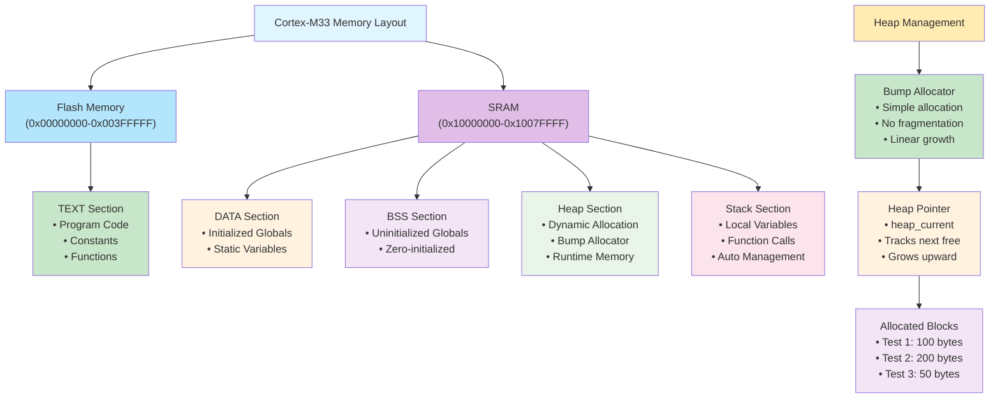
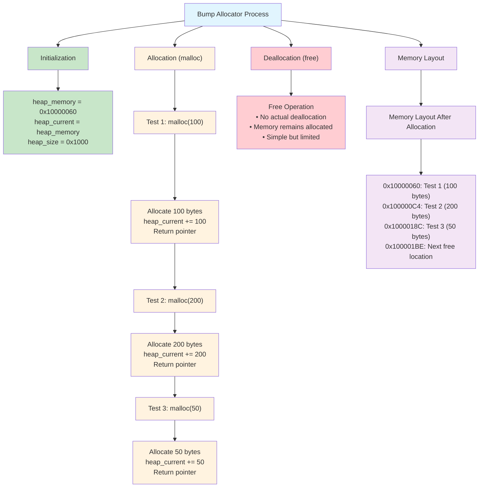
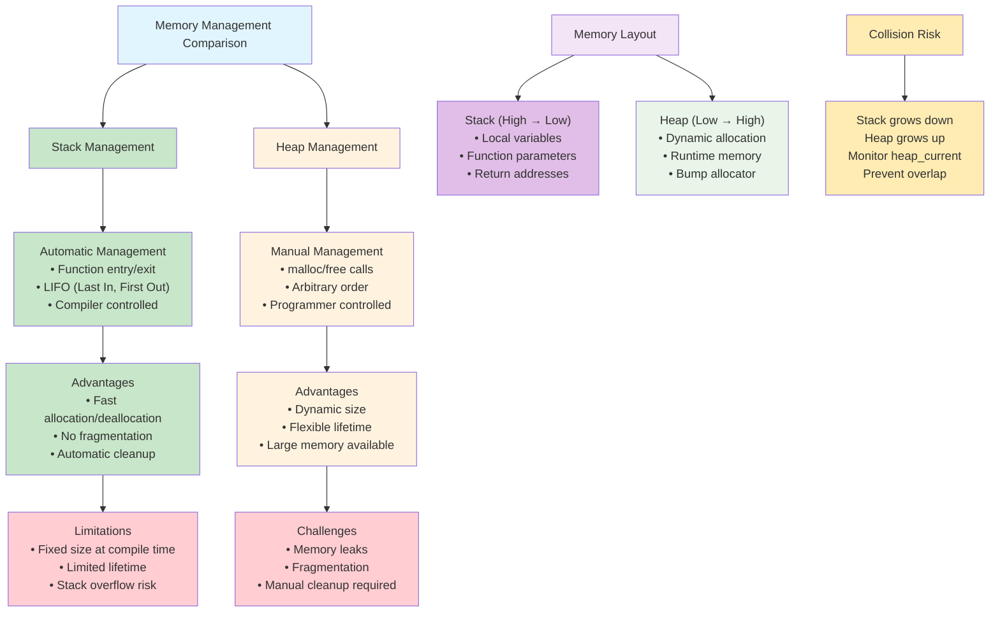

# 4. 힙 구현 - 동적 메모리 할당의 이해

이 예제에서는 Cortex-M33에서 간단한 Bump Allocator를 구현하면서 동적 메모리 할당의 원리와 힙 관리 방법을 GDB를 활용하여 분석해보겠습니다.

## 📋 학습 목표

- 힙의 필요성과 동적 메모리 할당의 장점 이해
- Bump Allocator의 구현 원리와 한계점 분석
- malloc/free의 동작 원리와 메모리 단편화 문제
- 힙과 스택 간의 충돌 방지 방법
- GDB를 활용한 힙 메모리 상태 실시간 모니터링

## 🛠️ 사전 준비

### 1. 프로젝트 빌드
```bash
make clean && make
```

**빌드 결과 분석:**
```
   text    data     bss     dec     hex filename
   2612      12      48    2672     a70 build/cortex-m33-hello-world.elf
```

- **text (2612 bytes)**: 프로그램 코드 + 상수 데이터
- **data (12 bytes)**: 초기화된 전역 변수
- **bss (48 bytes)**: 초기화되지 않은 전역 변수

### 2. 프로그램 실행으로 메모리 주소 확인
```bash
qemu-system-arm -machine mps2-an505 -cpu cortex-m33 -kernel build/cortex-m33-hello-world.elf -nographic -monitor none -serial stdio -semihosting
```

**실행 결과에서 확인되는 메모리 주소:**
- DATA 영역: `268438088` (0x10000388)
- BSS 영역: `268438096` (0x10000390)  
- STACK 영역: `268959644` (0x1007FE2C)
- TEXT 영역: `268435473` (0x10000011)

## 📊 힙 메모리 관리 시각화

### 메모리 레이아웃과 힙 구조 다이어그램



### Bump Allocator 동작 과정 다이어그램



### 힙 vs 스택 메모리 관리 비교 다이어그램



## 🔍 메모리 영역별 상세 분석

### TEXT 영역 (코드 + 상수)
```c
// 함수 코드 (TEXT 영역)
int power_of_16_iterative(int x) { ... }

// 읽기 전용 상수 (RODATA/TEXT 영역)
const int CONSTANT_TABLE[5] = {1, 2, 4, 8, 16};
```

### DATA 영역 (초기화된 전역 변수)
```c
int base_value = 2;           // 초기값 2로 설정
int exponent = 16;           // 초기값 16으로 설정
const char* message = "..."; // 문자열 포인터
```

### BSS 영역 (초기화되지 않은 전역 변수)
```c
int result_array[10];        // 자동으로 0으로 초기화
int calculation_count;       // 자동으로 0으로 초기화
int* dynamic_pointer;        // 자동으로 NULL로 초기화
```

## 🚀 GDB를 활용한 힙 메모리 분석

### 1단계: QEMU와 GDB 연결

```bash
# 터미널 1: QEMU GDB 서버 모드로 실행
qemu-system-arm -machine mps2-an505 -cpu cortex-m33 -kernel build/cortex-m33-hello-world.elf -nographic -monitor none -serial stdio -semihosting -s -S
```

```bash
# 터미널 2: GDB 시작 및 연결
gdb-multiarch build/cortex-m33-hello-world.elf
```

### 2단계: GDB 세션 시작 및 연결

```bash
# GDB에서 QEMU에 연결
(gdb) target remote :1234

# 프로그램 로드
(gdb) load

# 심볼 정보 확인
(gdb) info files
(gdb) info functions
```

### 3단계: 메모리 영역 분석

#### 힙 메모리 분석을 위한 기본 GDB 명령어

```bash
# 힙 관련 전역 변수 확인
(gdb) print &heap_memory
(gdb) print &heap_current
(gdb) print heap_current - heap_memory

# 브레이크포인트 설정
(gdb) break main
(gdb) break simple_malloc
(gdb) break simple_free

# 프로그램 실행
(gdb) continue
```

**예상 결과:**
```
&base_value = 0x10000388 (DATA 영역)
base_value = 2 (초기화된 값)
```

#### BSS 영역 분석
```bash
# BSS 영역 변수 주소 확인
curl -X POST http://localhost:8000/tools/call \
  -H "Content-Type: application/json" \
  -d '{
    "name": "gdb_command",
    "arguments": {
      "session_id": "your-session-id",
      "command": "print &result_array"
    }
  }'

# BSS 영역이 0으로 초기화되었는지 확인
curl -X POST http://localhost:8000/tools/call \
  -H "Content-Type: application/json" \
  -d '{
    "name": "gdb_examine",
    "arguments": {
      "session_id": "your-session-id",
      "expression": "&result_array",
      "count": 10,
      "format": "xw"
    }
  }'
```

### 4단계: 함수 실행 중 메모리 변화 관찰

```bash
# main 함수에 브레이크포인트 설정
curl -X POST http://localhost:8000/tools/call \
  -H "Content-Type: application/json" \
  -d '{
    "name": "gdb_set_breakpoint",
    "arguments": {
      "session_id": "your-session-id",
      "location": "main"
    }
  }'

# analyze_memory_regions 함수에 브레이크포인트 설정
curl -X POST http://localhost:8000/tools/call \
  -H "Content-Type: application/json" \
  -d '{
    "name": "gdb_set_breakpoint",
    "arguments": {
      "session_id": "your-session-id",
      "location": "analyze_memory_regions"
    }
  }'

# 프로그램 실행
curl -X POST http://localhost:8000/tools/call \
  -H "Content-Type: application/json" \
  -d '{
    "name": "gdb_continue",
    "arguments": {
      "session_id": "your-session-id"
    }
  }'
```

### 5단계: 지역 변수(스택) 분석

```bash
# 스택 프레임 정보 확인
curl -X POST http://localhost:8000/tools/call \
  -H "Content-Type: application/json" \
  -d '{
    "name": "gdb_command",
    "arguments": {
      "session_id": "your-session-id",
      "command": "info frame"
    }
  }'

# 지역 변수 확인
curl -X POST http://localhost:8000/tools/call \
  -H "Content-Type: application/json" \
  -d '{
    "name": "gdb_command",
    "arguments": {
      "session_id": "your-session-id",
      "command": "info locals"
    }
  }'

# 지역 변수 주소 확인
curl -X POST http://localhost:8000/tools/call \
  -H "Content-Type: application/json" \
  -d '{
    "name": "gdb_command",
    "arguments": {
      "session_id": "your-session-id",
      "command": "print &local_var"
    }
  }'
```

### 6단계: 포인터 동작 분석

```bash
# pointer_experiments 함수에 브레이크포인트
curl -X POST http://localhost:8000/tools/call \
  -H "Content-Type: application/json" \
  -d '{
    "name": "gdb_set_breakpoint",
    "arguments": {
      "session_id": "your-session-id",
      "location": "pointer_experiments"
    }
  }'

# 포인터 값 확인
curl -X POST http://localhost:8000/tools/call \
  -H "Content-Type: application/json" \
  -d '{
    "name": "gdb_print",
    "arguments": {
      "session_id": "your-session-id",
      "expression": "ptr_to_base"
    }
  }'

# 포인터가 가리키는 값 확인
curl -X POST http://localhost:8000/tools/call \
  -H "Content-Type: application/json" \
  -d '{
    "name": "gdb_print",
    "arguments": {
      "session_id": "your-session-id",
      "expression": "*ptr_to_base"
    }
  }'
```

### 7단계: 메모리 변경 관찰

```bash
# 포인터를 통한 값 변경 전
curl -X POST http://localhost:8000/tools/call \
  -H "Content-Type: application/json" \
  -d '{
    "name": "gdb_print",
    "arguments": {
      "session_id": "your-session-id",
      "expression": "base_value"
    }
  }'

# 다음 라인 실행 (포인터를 통한 값 변경)
curl -X POST http://localhost:8000/tools/call \
  -H "Content-Type: application/json" \
  -d '{
    "name": "gdb_next",
    "arguments": {
      "session_id": "your-session-id"
    }
  }'

# 값 변경 후 확인
curl -X POST http://localhost:8000/tools/call \
  -H "Content-Type: application/json" \
  -d '{
    "name": "gdb_print",
    "arguments": {
      "session_id": "your-session-id",
      "expression": "base_value"
    }
  }'
```

## 📊 메모리 맵 분석

### 링커 스크립트로 메모리 배치 확인

```bash
# 심볼 테이블 확인
curl -X POST http://localhost:8000/tools/call \
  -H "Content-Type: application/json" \
  -d '{
    "name": "gdb_command",
    "arguments": {
      "session_id": "your-session-id",
      "command": "info variables"
    }
  }'

# 섹션 정보 확인
curl -X POST http://localhost:8000/tools/call \
  -H "Content-Type: application/json" \
  -d '{
    "name": "gdb_command",
    "arguments": {
      "session_id": "your-session-id",
      "command": "maintenance info sections"
    }
  }'
```

### 메모리 영역별 주소 범위

**Cortex-M33 MPS2-AN505 메모리 맵:**
- **0x00000000 - 0x003FFFFF**: Code Memory (4MB)
- **0x10000000 - 0x1007FFFF**: SRAM (512KB)
  - **DATA 영역**: 0x10000000 이후 (초기화된 전역 변수)
  - **BSS 영역**: DATA 영역 이후 (초기화되지 않은 전역 변수)
  - **Heap 영역**: BSS 영역 이후 (동적 할당, 현재 미사용)
  - **Stack 영역**: 0x1007FFFF부터 아래로 성장

## 🔧 실험과 관찰

### 실험 1: 전역 변수 vs 지역 변수
```bash
# 전역 변수와 지역 변수의 주소 비교
curl -X POST http://localhost:8000/tools/call \
  -H "Content-Type: application/json" \
  -d '{
    "name": "gdb_command",
    "arguments": {
      "session_id": "your-session-id",
      "command": "print &base_value, &local_var"
    }
  }'
```

**관찰 포인트:**
- 전역 변수는 낮은 주소 (DATA/BSS 영역)
- 지역 변수는 높은 주소 (Stack 영역)

### 실험 2: 배열과 포인터 산술
```bash
# 배열 요소들의 연속된 주소 확인
curl -X POST http://localhost:8000/tools/call \
  -H "Content-Type: application/json" \
  -d '{
    "name": "gdb_command",
    "arguments": {
      "session_id": "your-session-id",
      "command": "print &result_array[0], &result_array[1], &result_array[2]"
    }
  }'
```

### 실험 3: 상수 데이터 위치
```bash
# 상수 테이블 주소 확인
curl -X POST http://localhost:8000/tools/call \
  -H "Content-Type: application/json" \
  -d '{
    "name": "gdb_command",
    "arguments": {
      "session_id": "your-session-id",
      "command": "print &CONSTANT_TABLE"
    }
  }'

# 상수 데이터 수정 시도 (실패해야 함)
curl -X POST http://localhost:8000/tools/call \
  -H "Content-Type: application/json" \
  -d '{
    "name": "gdb_command",
    "arguments": {
      "session_id": "your-session-id",
      "command": "set variable CONSTANT_TABLE[0] = 999"
    }
  }'
```

## 📈 성능과 메모리 최적화

### 메모리 사용량 최적화 팁

1. **불필요한 전역 변수 줄이기**: BSS/DATA 영역 절약
2. **상수는 const로 선언**: TEXT 영역에 배치되어 RAM 절약
3. **지역 변수 활용**: 함수 종료 시 자동 해제

### 컴파일러 최적화 확인
```bash
# 최적화된 코드 확인
curl -X POST http://localhost:8000/tools/call \
  -H "Content-Type: application/json" \
  -d '{
    "name": "gdb_command",
    "arguments": {
      "session_id": "your-session-id",
      "command": "disassemble power_of_16_iterative"
    }
  }'
```

## 🎯 퀴즈

1. DATA 영역과 BSS 영역의 차이점은 무엇인가요?
2. 왜 상수 데이터는 RAM이 아닌 Flash 메모리에 저장되나요?
3. 포인터 변수 자체는 어느 메모리 영역에 저장되나요?
4. 전역 변수 대신 지역 변수를 사용하면 어떤 장점이 있나요?

## 💡 핵심 개념 정리

### 메모리 영역별 특성

| 영역 | 저장 내용 | 초기화 | 위치 | 특징 |
|------|-----------|--------|------|------|
| TEXT | 프로그램 코드, 상수 | 컴파일 시 | Flash/ROM | 읽기 전용 |
| DATA | 초기화된 전역변수 | 부팅 시 ROM에서 복사 | RAM | 읽기/쓰기 |
| BSS | 초기화되지 않은 전역변수 | 부팅 시 0으로 설정 | RAM | 읽기/쓰기 |
| Stack | 지역변수, 함수 매개변수 | 함수 호출 시 | RAM | 자동 관리 |

---

**다음 단계**: [03-stack-analysis](../03-stack-analysis/) - 스택과 함수 호출 분석