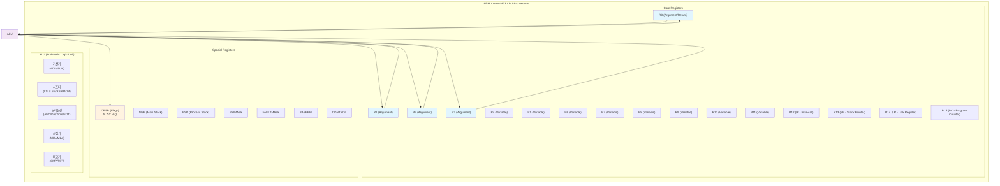
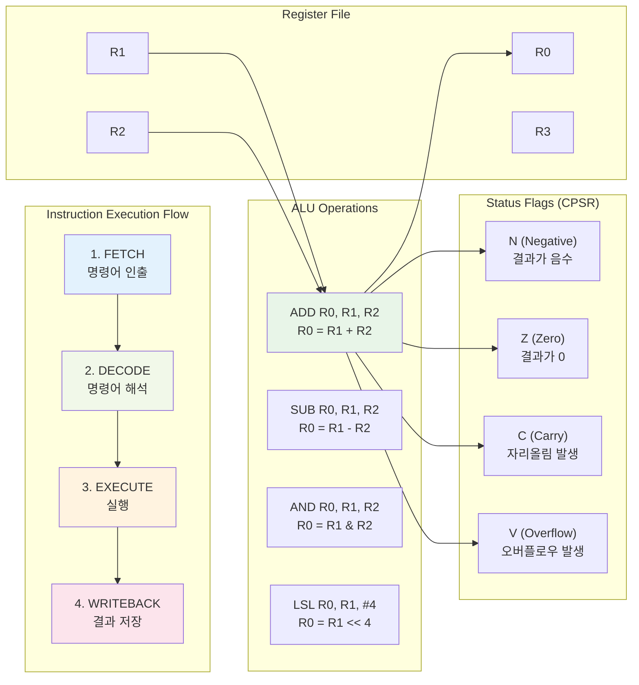

# 05. CPU General Register & ALU 심화 학습

## 📚 학습 목표

이 모듈에서는 ARM Cortex-M33의 **General Purpose Register**와 **ALU(Arithmetic Logic Unit)**의 동작을 심도 있게 학습합니다.

### 학습 내용
- ARM Cortex-M33의 레지스터 구조 이해
- ALU의 다양한 연산 방식 학습
- ISA(Instruction Set Architecture)에 따른 레지스터 변화 관찰
- GDB를 통한 실시간 레지스터 상태 분석
- 다양한 연산자와 플래그 동작 실습

---

## 🏗️ ARM Cortex-M33 CPU 구조

### CPU 전체 구조도



### 명령어 실행 흐름



---

## 📋 General Purpose Registers

### 레지스터 분류

| 레지스터 | 용도 | 설명 |
|----------|------|------|
| **R0-R3** | 인수/반환값 | 함수 호출 시 인수 전달 및 반환값 저장 |
| **R4-R11** | 범용 변수 | 범용 데이터 저장, 함수 호출 간 보존 |
| **R12 (IP)** | Intra-call | 함수 내부 임시 데이터 저장 |
| **R13 (SP)** | Stack Pointer | 스택 주소 관리 |
| **R14 (LR)** | Link Register | 함수 반환 주소 저장 |
| **R15 (PC)** | Program Counter | 현재 실행 중인 명령어 주소 |

### 특수 레지스터

| 레지스터 | 설명 |
|----------|------|
| **CPSR** | Current Program Status Register (플래그) |
| **MSP** | Main Stack Pointer |
| **PSP** | Process Stack Pointer |
| **PRIMASK** | 우선순위 마스크 |
| **FAULTMASK** | 폴트 마스크 |
| **BASEPRI** | 기본 우선순위 |
| **CONTROL** | 제어 레지스터 |

---

## ⚙️ ALU (Arithmetic Logic Unit) 연산

### 산술 연산

| 명령어 | 기능 | 예시 | 플래그 영향 |
|--------|------|------|-------------|
| `ADD` | 덧셈 | `ADD R0, R1, R2` | N, Z, C, V |
| `SUB` | 뺄셈 | `SUB R0, R1, R2` | N, Z, C, V |
| `MUL` | 곱셈 | `MUL R0, R1, R2` | N, Z |
| `RSB` | 역순 뺄셈 | `RSB R0, R1, R2` | N, Z, C, V |

### 논리 연산

| 명령어 | 기능 | 예시 | 플래그 영향 |
|--------|------|------|-------------|
| `AND` | 논리곱 | `AND R0, R1, R2` | N, Z |
| `ORR` | 논리합 | `ORR R0, R1, R2` | N, Z |
| `EOR` | 배타적 논리합 | `EOR R0, R1, R2` | N, Z |
| `MVN` | 논리 부정 | `MVN R0, R1` | N, Z |

### 시프트 연산

| 명령어 | 기능 | 예시 | 설명 |
|--------|------|------|------|
| `LSL` | 논리 좌측 시프트 | `LSL R0, R1, #4` | 0으로 채움 |
| `LSR` | 논리 우측 시프트 | `LSR R0, R1, #4` | 0으로 채움 |
| `ASR` | 산술 우측 시프트 | `ASR R0, R1, #4` | 부호비트로 채움 |
| `ROR` | 회전 | `ROR R0, R1, #4` | 비트 순환 |

### 비교 연산

| 명령어 | 기능 | 예시 | 설명 |
|--------|------|------|------|
| `CMP` | 비교 | `CMP R0, R1` | R0 - R1, 플래그만 설정 |
| `TST` | 테스트 | `TST R0, R1` | R0 & R1, 플래그만 설정 |
| `TEQ` | 동등 테스트 | `TEQ R0, R1` | R0 ^ R1, 플래그만 설정 |

---

## 🚩 CPSR 플래그 레지스터

### 플래그 비트

| 비트 | 플래그 | 의미 | 설정 조건 |
|------|--------|------|-----------|
| **31** | N (Negative) | 음수 | 결과의 최상위 비트가 1 |
| **30** | Z (Zero) | 제로 | 결과가 0 |
| **29** | C (Carry) | 자리올림 | 무부호 연산에서 자리올림/빌림 |
| **28** | V (oVerflow) | 오버플로우 | 부호 있는 연산에서 오버플로우 |
| **27** | Q (Sticky overflow) | 누적 오버플로우 | DSP 연산 오버플로우 |

---

## 🛠️ 개발 환경 설정

### 필수 도구 설치

```bash
# ARM 툴체인 설치
sudo apt-get install gcc-arm-none-eabi

# 디버거 설치  
sudo apt-get install gdb-multiarch

# QEMU 설치
sudo apt-get install qemu-system-arm

# GDB 다중 아키텍처 지원 확인
gdb-multiarch --version
```

---

## 🚀 프로젝트 빌드 및 실행

### 1. 프로젝트 빌드

```bash
cd 05-register-alu
make clean
make
```

### 2. 일반 실행

```bash
make run
# 또는
./scripts/run.sh
```

### 3. 디버그 모드 실행

```bash
make debug
# 또는  
./scripts/debug.sh
```

---

## 🔬 GDB 디버깅 활용

### 기본 GDB 연결

```bash
# 터미널 1: QEMU 디버그 모드 실행
make debug

# 터미널 2: GDB 연결
gdb-multiarch build/cortex-m33-register-demo.elf
(gdb) target remote :1234
(gdb) load
```

### 레지스터 관찰 명령어

```bash
# 모든 레지스터 상태 확인
(gdb) info registers

# 특정 레지스터 확인
(gdb) print /x $r0
(gdb) print /x $r1
(gdb) print /x $cpsr

# 레지스터 값 변경
(gdb) set $r0 = 0x12345678
(gdb) set $r1 = 0x87654321
```

### 실습용 브레이크포인트 설정

```bash
# 함수별 브레이크포인트
(gdb) break register_demo_basic
(gdb) break register_demo_bitwise
(gdb) break register_demo_shift
(gdb) break register_demo_conditional

# 주요 라인 브레이크포인트 (main.c 기준)
(gdb) break main.c:39   # 기본 연산 초기값
(gdb) break main.c:42   # ADD 연산 후
(gdb) break main.c:45   # SUB 연산 후
(gdb) break main.c:48   # MUL 연산 후
```

---

## 🔍 ISA별 레지스터 변화 관찰

### 1. 기본 산술 연산 분석

#### 연산 전 상태
```
R0: 0x12345678
R1: 0x87654321  
R2: 0x00000000
CPSR: 0x01000000 (N=0 Z=0 C=0 V=0)
```

#### ADD R2, R0, R1 실행
```bash
(gdb) break main.c:42
(gdb) continue
(gdb) info registers
```

#### 연산 후 상태
```
R0: 0x12345678 (변화없음)
R1: 0x87654321 (변화없음)
R2: 0x99999999 (결과)
CPSR: 0x80000000 (N=1 Z=0 C=0 V=0)
```

**🔍 분석**:
- R2에 덧셈 결과 저장
- 결과가 음수이므로 N 플래그 설정
- 자리올림이 없으므로 C 플래그 클리어

### 2. 비트 연산 분석

#### AND 연산 예제
```bash
# 브레이크포인트 설정
(gdb) break main.c:63

# 연산 전 상태 확인
(gdb) continue
(gdb) info registers
```

#### 연산 전후 상태
```
Before: R0=0xF0F0F0F0, R1=0x0F0F0F0F
After:  R2=0x00000000 (AND 결과)
CPSR: Z=1 (결과가 0이므로 Zero 플래그 설정)
```

### 3. 시프트 연산 분석

#### 좌측 시프트 (LSL) 분석
```bash
(gdb) break main.c:86
(gdb) continue

# 시프트 전: R0=0x12345678, shift_count=4
# 시프트 후: R2=0x23456780 (4비트 좌측 시프트)
```

**🔍 시프트 동작**:
- `0x12345678 << 4` = `0x23456780`
- 최상위 4비트 (0x1)가 사라짐
- 최하위에 4개의 0 추가

### 4. 조건부 연산 및 플래그 분석

#### 비교 연산 (CMP) 분석
```bash
(gdb) break main.c:105
(gdb) continue

# CMP 100, 50 실행 후
# CPSR 확인: C=1, Z=0 (100 > 50이므로 Carry 설정)
```

#### 조건부 명령 실행
```bash
# MOVGT (Move if Greater Than) 실행
# 100 > 50이 참이므로 R2 = 1로 설정
(gdb) print /x $r2
# 출력: 0x1
```

---

## 📊 고급 GDB 활용 기법

### 레지스터 자동 추적

```bash
# 레지스터 변화 자동 표시
(gdb) display /x $r0
(gdb) display /x $r1
(gdb) display /x $r2
(gdb) display /x $cpsr

# 조건부 브레이크포인트
(gdb) break main.c:42 if $r0 == 0x12345678
```

### 레지스터 상태 로깅

```bash
# GDB 로그 활성화
(gdb) set logging on register_log.txt
(gdb) set logging overwrite on

# 명령어 자동 실행
(gdb) commands 1
> info registers r0 r1 r2 cpsr
> continue
> end
```

---

## 📈 학습 실습 과제

### 과제 1: 기본 연산 분석
1. `register_demo_basic()` 함수를 실행하며 각 연산 후 레지스터 상태 기록
2. ADD, SUB, MUL 연산에서 플래그 변화 분석
3. 오버플로우가 발생하는 케이스 찾기

### 과제 2: 비트 연산 마스터
1. `register_demo_bitwise()` 함수의 모든 연산 분석
2. AND, OR, XOR, NOT 연산의 실제 비트 변화 추적
3. 비트 마스킹 기법 응용 예제 작성

### 과제 3: 시프트 연산 심화
1. 양수와 음수에서 ASR(산술 시프트) 동작 차이 분석
2. ROR(회전) 연산에서 캐리 플래그 동작 확인
3. 시프트 연산을 활용한 빠른 곱셈/나눗셈 구현

### 과제 4: 조건부 실행 활용
1. 다양한 조건 코드 (EQ, NE, GT, LT 등) 테스트
2. 조건부 명령을 활용한 분기 없는 알고리즘 구현
3. 플래그 조합을 활용한 복잡한 조건 판단

---

## 🎯 고급 분석 기법

### 레지스터 변화 패턴 분석

```bash
# 연속적인 연산에서 레지스터 사용 패턴 관찰
(gdb) commands 1
> info registers r0 r1 r2 cpsr
> continue
> end

# 자동화된 분석 스크립트
(gdb) source analysis_script.gdb
```

### 성능 측정 및 최적화

```bash
# 명령어 실행 사이클 측정
(gdb) set logging on analysis.log
(gdb) monitor info registers
(gdb) stepi
(gdb) monitor info registers
```

### 메모리와 레지스터 상호작용

```bash
# 스택 연산에서 레지스터-메모리 데이터 흐름 추적
(gdb) break register_demo_stack_operations
(gdb) continue
(gdb) x/8wx $sp    # 스택 메모리 내용 확인
(gdb) info registers r0 r1 r2 r3
```

---

## 📚 추가 학습 자료

### ARM 아키텍처 참고 문서
- [ARM Cortex-M33 Technical Reference Manual](https://developer.arm.com/documentation/100230/latest/)
- [ARMv8-M Architecture Reference Manual](https://developer.arm.com/documentation/ddi0553/latest/)

### 디버깅 도구 활용
- [GDB User Manual](https://sourceware.org/gdb/current/onlinedocs/gdb/)
- [QEMU User Documentation](https://qemu-project.gitlab.io/qemu/system/targets.html)

### 어셈블리 프로그래밍
- [ARM Assembly Language Programming](https://www.arm.com/why-arm/technologies/instruction-set-architectures)
- [Thumb-2 Instruction Set](https://developer.arm.com/documentation/ddi0308/latest/)

---

## 🔧 문제 해결

### 일반적인 오류 해결

1. **빌드 오류**
   ```bash
   # 툴체인 확인
   arm-none-eabi-gcc --version
   
   # 클린 빌드
   make clean && make
   ```

2. **QEMU 연결 오류**
   ```bash
   # 포트 확인
   netstat -an | grep 1234
   
   # QEMU 프로세스 정리
   pkill qemu-system-arm
   ```

3. **GDB 연결 실패**
   ```bash
   # GDB 버전 확인
   gdb-multiarch --version
   
   # 원격 연결 재시도
   (gdb) disconnect
   (gdb) target remote :1234
   ```

---

이 모듈을 통해 ARM Cortex-M33의 레지스터와 ALU 동작을 깊이 이해하고, 실제 하드웨어 레벨에서의 연산 과정을 관찰할 수 있습니다. 각 실습을 통해 마이크로컨트롤러의 핵심 동작 원리를 체득하시기 바랍니다! 🚀
