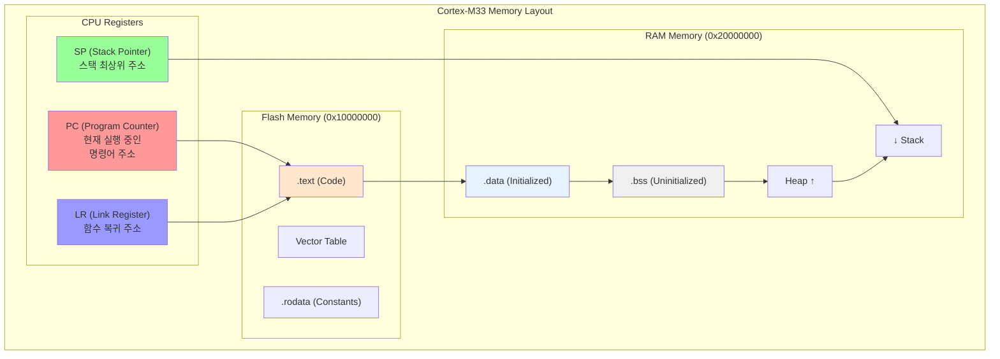
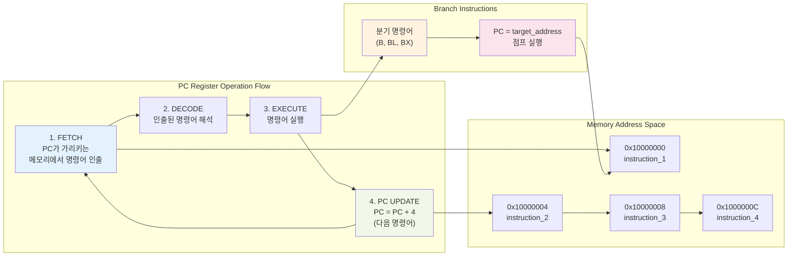
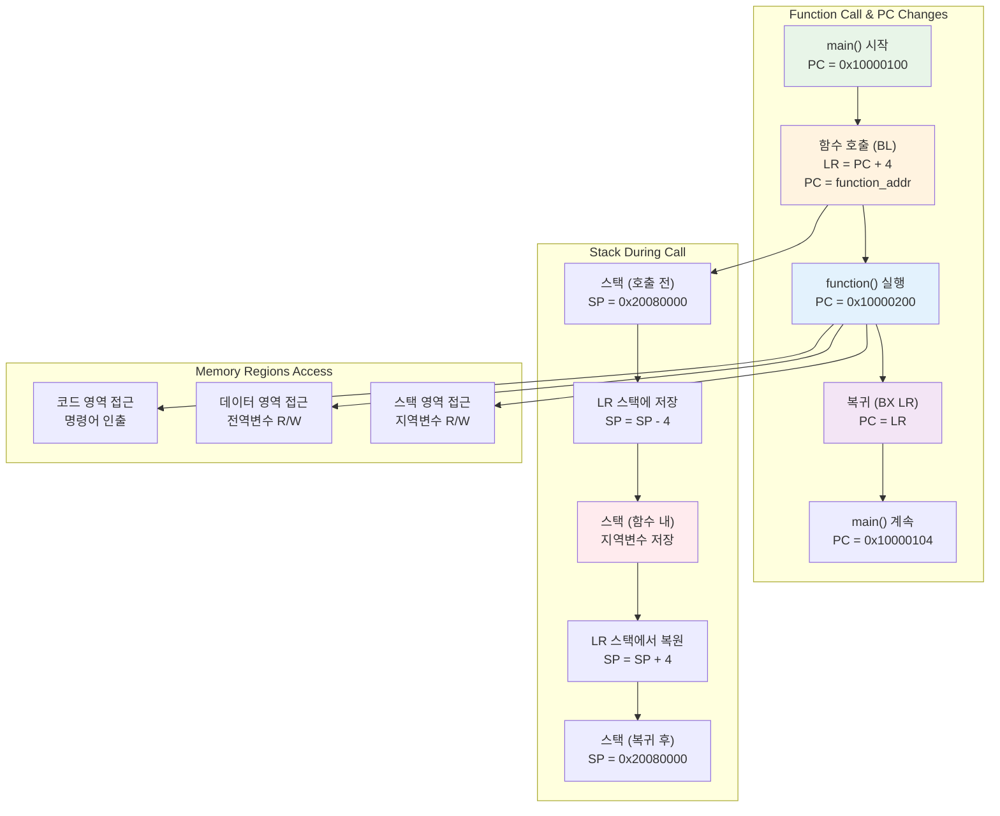

# 06. 메인메모리 & PC레지스터 심화 학습

## 📚 학습 목표

이 모듈에서는 ARM Cortex-M33의 **메인메모리 구조**와 **PC(Program Counter) 레지스터**의 동작을 심도 있게 학습합니다.

### 학습 내용
- 메인메모리의 물리적 구조와 메모리 맵 이해
- PC 레지스터의 역할과 명령어 인출 과정
- 함수 호출 시 PC와 스택의 상호작용
- 메모리 접근 패턴과 성능 영향
- GDB를 통한 실시간 PC 추적 및 메모리 분석

---

## 🏗️ Cortex-M33 메모리 아키텍처

### 전체 메모리 레이아웃



### 메모리 영역별 특성

| 메모리 영역 | 주소 범위 | 특성 | 용도 |
|-------------|-----------|------|------|
| **Flash (.text)** | 0x10000000~ | 읽기 전용, 비휘발성 | 프로그램 코드, 상수 |
| **RAM (.data)** | 0x20000000~ | 읽기/쓰기, 휘발성 | 초기화된 전역변수 |
| **RAM (.bss)** | .data 이후 | 읽기/쓰기, 0으로 초기화 | 초기화되지 않은 전역변수 |
| **Heap** | .bss 이후 | 동적 할당 영역 | malloc/free 영역 |
| **Stack** | 0x20080000부터 하향 | 지역변수, 함수 호출 | 임시 데이터 저장 |

---

## 🎯 PC (Program Counter) 레지스터

### PC 레지스터의 역할

**PC(Program Counter)**는 현재 실행 중인 명령어의 메모리 주소를 저장하는 특수 레지스터입니다.

#### 주요 특징
- **크기**: 32비트 (최대 4GB 주소 공간)
- **자동 증가**: 명령어 실행 후 자동으로 다음 주소로 이동
- **분기 제어**: 조건부/무조건부 분기 시 목적지 주소로 변경
- **함수 호출**: BL 명령어로 서브루틴 호출 시 변경

### PC 동작 흐름



---

## 🔄 함수 호출과 PC 변화

### 함수 호출 메커니즘



### 함수 호출 시퀀스

| 단계 | 동작 | PC 상태 | LR 상태 | 스택 상태 |
|------|------|---------|---------|-----------|
| 1 | `BL function` 실행 | PC = function 주소 | LR = 복귀 주소 | 변화 없음 |
| 2 | 함수 프롤로그 | PC = 함수 내부 | LR 유지 | LR 저장, SP 감소 |
| 3 | 함수 본체 실행 | PC = 함수 코드 | LR 유지 | 지역변수 저장 |
| 4 | 함수 에필로그 | PC = 함수 끝 | LR 복원 | SP 복원 |
| 5 | `BX LR` 실행 | PC = 복귀 주소 | LR 사용 | 원래 상태 |

---

## 🛠️ 개발 환경 설정

### 필수 도구 설치

```bash
# ARM 툴체인 설치
sudo apt-get install gcc-arm-none-eabi

# 디버거 설치  
sudo apt-get install gdb-multiarch

# QEMU 설치
sudo apt-get install qemu-system-arm
```

---

## 🚀 프로젝트 빌드 및 실행

### 1. 프로젝트 빌드

```bash
cd 06-memory-pc
make clean
make
```

### 2. 일반 실행

```bash
make run
```

### 3. 디버그 모드 실행

```bash
make debug
```

---

## 🔬 GDB 디버깅 활용

### 기본 GDB 연결

```bash
# 터미널 1: QEMU 디버그 모드 실행
make debug

# 터미널 2: GDB 연결
gdb-multiarch build/cortex-m33-memory-pc.elf
(gdb) target remote :1234
(gdb) load
```

### PC 레지스터 추적

```bash
# PC 레지스터 확인
(gdb) print /x $pc
(gdb) info registers pc

# PC 변화 추적
(gdb) display /x $pc
(gdb) stepi    # 한 명령어씩 실행하며 PC 관찰

# 함수별 PC 확인
(gdb) info symbol $pc    # 현재 PC가 위치한 함수 확인
```

### 메모리 영역 분석

```bash
# 메모리 맵 확인
(gdb) info proc mappings
(gdb) maintenance info sections

# 특정 주소의 메모리 내용 확인
(gdb) x/10i $pc          # 현재 PC부터 10개 명령어
(gdb) x/8wx 0x20000000   # RAM 시작 부분 8워드
(gdb) x/8wx 0x10000000   # Flash 시작 부분 8워드

# 변수 주소 확인
(gdb) print &flash_string
(gdb) print &initialized_data
(gdb) print &uninitialized_data
```

### 함수 호출 추적

```bash
# 호출 스택 확인
(gdb) backtrace
(gdb) info frame

# LR 레지스터 확인
(gdb) print /x $lr

# 스택 내용 확인
(gdb) x/16wx $sp
```

---

## 🔍 실습 시나리오

### 1. 메모리 레이아웃 분석

#### 브레이크포인트 설정
```bash
(gdb) break memory_layout_demo
(gdb) break main.c:71   # 메모리 주소 분석 시작
(gdb) break main.c:88   # 메모리 주소 분석 완료
```

#### 분석 과정
```bash
(gdb) continue
(gdb) info registers pc sp

# 각 변수의 주소 확인
(gdb) print &flash_string        # Flash 영역
(gdb) print &initialized_data    # .data 영역  
(gdb) print &uninitialized_data  # .bss 영역
(gdb) print &local_var           # 스택 영역
```

#### 🔍 예상 결과
```
flash_string 주소:     0x10000200 (Flash)
initialized_data 주소: 0x10001000 (.data)
uninitialized_data 주소: 0x10001004 (.bss)
local_var 주소:        0x2007FFF0 (Stack)
```

### 2. PC 점프 동작 분석

#### 브레이크포인트 설정
```bash
(gdb) break pc_jump_demo
(gdb) break main.c:95   # 점프 전 PC
(gdb) break main.c:99   # if 브랜치 내부
(gdb) break main.c:105  # 분기 후 합류점
```

#### PC 변화 추적
```bash
(gdb) continue
(gdb) display /x $pc
(gdb) stepi              # 조건부 분기 명령어 실행
(gdb) stepi              # 분기 후 PC 확인
```

### 3. 함수 호출 시 PC와 스택 상호작용

#### 브레이크포인트 설정
```bash
(gdb) break function_b
(gdb) break function_a
(gdb) break main.c:34   # function_a의 PC 확인
```

#### 함수 호출 추적
```bash
(gdb) continue
(gdb) info registers pc lr
(gdb) backtrace          # 호출 스택 확인

# function_a 호출 시
(gdb) continue
(gdb) info registers pc lr
(gdb) x/4wx $sp          # 스택에 저장된 복귀 주소
```

#### 🔍 분석 포인트
- **BL 명령어 실행 시**: LR에 복귀 주소 저장, PC가 함수 주소로 점프
- **함수 내부**: PC가 함수 코드를 순차 실행
- **BX LR 실행 시**: PC가 LR 값으로 복원되어 호출자로 복귀

### 4. 메모리 접근 패턴 분석

#### 브레이크포인트 설정
```bash
(gdb) break memory_access_patterns
(gdb) break main.c:159  # 순차 접근 시작
(gdb) break main.c:165  # 각 원소 접근 시
(gdb) break main.c:172  # 임의 접근 시작
```

#### 접근 패턴 관찰
```bash
# 순차 접근 패턴
(gdb) continue
(gdb) watch sequential_array[0]   # 배열 원소 감시
(gdb) continue
(gdb) print sequential_array      # 배열 전체 상태

# 임의 접근 패턴  
(gdb) continue
(gdb) print indices              # 접근 순서 확인
```

### 5. 명령어 인출(Fetch) 분석

#### 브레이크포인트 설정
```bash
(gdb) break instruction_fetch_demo
(gdb) break main.c:184  # NOP 명령어
(gdb) break main.c:188  # 산술 연산 전
(gdb) break main.c:193  # 메모리 접근 전
```

#### 명령어별 PC 변화 관찰
```bash
(gdb) continue
(gdb) x/5i $pc           # 현재 PC부터 5개 명령어 확인
(gdb) stepi              # 한 명령어씩 실행
(gdb) print /x $pc       # PC 값 변화 확인
```

---

## 📊 성능 분석 및 최적화

### 메모리 접근 성능

| 접근 타입 | 특성 | 성능 | 캐시 효율성 |
|-----------|------|------|-------------|
| **순차 접근** | 연속된 주소 접근 | 빠름 | 높음 |
| **임의 접근** | 비연속 주소 접근 | 느림 | 낮음 |
| **지역성 활용** | 최근 접근 주소 근처 | 보통 | 중간 |

### PC 분기 예측 최적화

```c
// 분기 예측에 유리한 코드
if (likely_condition) {
    // 자주 실행되는 경로
}

// 분기를 줄이는 최적화
result = condition ? value_a : value_b;  // 조건부 명령 활용
```

---

## 📈 학습 실습 과제

### 과제 1: 메모리 맵 완전 분석
1. 각 섹션(.text, .data, .bss, stack)의 정확한 주소 범위 측정
2. 링커 스크립트와 실제 주소 배치 비교
3. 메모리 사용량 최적화 방안 제시

### 과제 2: PC 추적 시스템 구현
1. 함수 호출 깊이별 PC 변화 기록
2. 분기 명령어별 PC 점프 패턴 분석
3. 반복문에서의 PC 순환 패턴 관찰

### 과제 3: 메모리 접근 최적화
1. 캐시 친화적인 데이터 구조 설계
2. 메모리 접근 패턴에 따른 성능 측정
3. 컴파일러 최적화 옵션별 PC 변화 비교

### 과제 4: 실시간 디버깅 스크립트
1. GDB 스크립트로 자동 PC 추적 시스템 구현
2. 메모리 영역별 접근 빈도 통계 수집
3. 함수 호출 그래프 자동 생성

---

## 🎯 고급 분석 기법

### 자동화된 PC 추적

```bash
# GDB 스크립트 예제 (pc_trace.gdb)
define trace_pc
    set logging on pc_trace.log
    while $pc < 0x10002000
        stepi
        printf "PC: 0x%08x, Instruction: ", $pc
        x/1i $pc
    end
    set logging off
end
```

### 메모리 사용량 분석

```bash
# 메모리 사용량 확인
(gdb) info proc stat
(gdb) monitor info mtree

# 섹션별 크기 확인
arm-none-eabi-size build/cortex-m33-memory-pc.elf
arm-none-eabi-objdump -h build/cortex-m33-memory-pc.elf
```

### 성능 프로파일링

```bash
# 명령어 실행 사이클 측정
(gdb) monitor info registers
(gdb) monitor info qtree
```

---

## 📚 추가 학습 자료

### ARM 아키텍처 심화
- [ARM Cortex-M33 Memory Model](https://developer.arm.com/documentation/100230/latest/)
- [ARMv8-M Memory Protection Unit](https://developer.arm.com/documentation/ddi0553/latest/)

### 메모리 관리 최적화
- [Embedded Systems Memory Management](https://www.embedded.com/memory-management/)
- [Cache-Friendly Programming Techniques](https://software.intel.com/content/www/us/en/develop/articles/cache-friendly-programming-techniques.html)

---

## 🔧 문제 해결

### 일반적인 디버깅 이슈

1. **PC 추적 실패**
   ```bash
   # 심볼 정보 확인
   (gdb) info symbols
   (gdb) file build/cortex-m33-memory-pc.elf
   ```

2. **메모리 주소 오류**
   ```bash
   # 메모리 맵 재확인
   (gdb) maintenance info sections
   arm-none-eabi-objdump -t build/cortex-m33-memory-pc.elf
   ```

3. **스택 오버플로우**
   ```bash
   # 스택 사용량 확인
   (gdb) info registers sp
   (gdb) print $sp - $initial_sp
   ```

---

이 모듈을 통해 ARM Cortex-M33의 메모리 구조와 PC 레지스터의 동작을 깊이 이해하고, 효율적인 메모리 관리와 프로그램 흐름 제어 기법을 습득할 수 있습니다! 🚀
