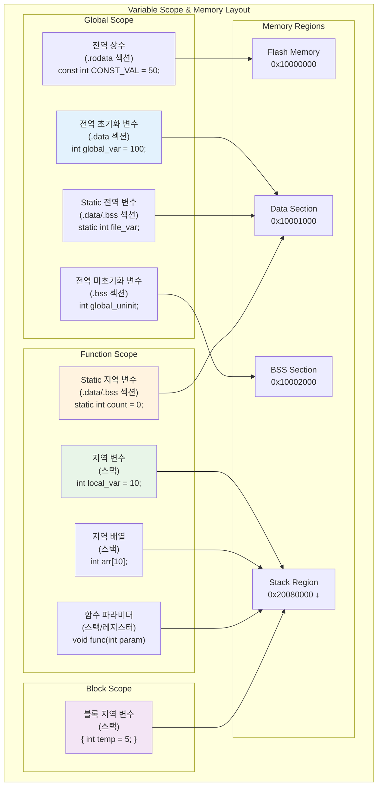
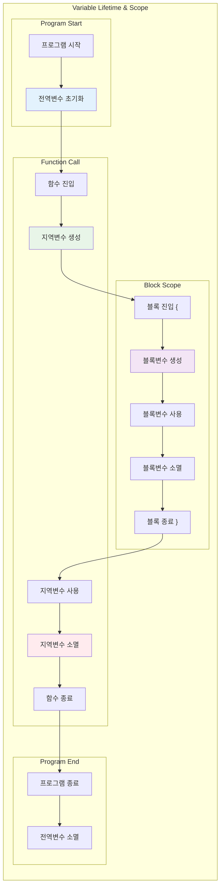
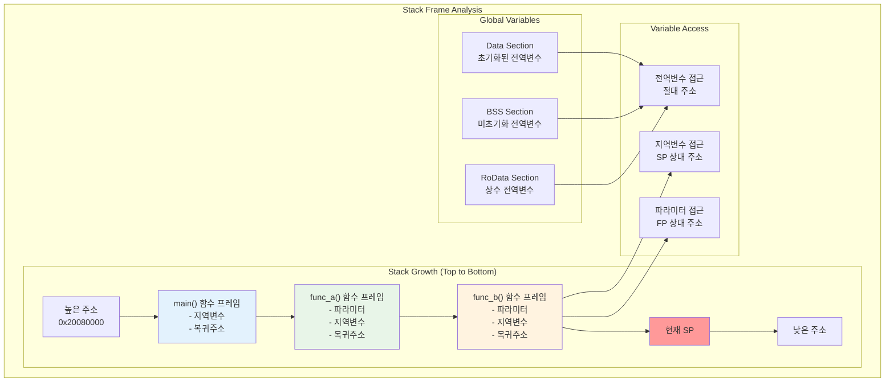

# 07. 지역변수 vs 전역변수 심화 학습

## 📚 학습 목표

이 모듈에서는 ARM Cortex-M33에서 **지역변수와 전역변수**의 차이점을 메모리 레벨에서 심도 있게 학습합니다.

### 학습 내용
- 변수 스코프(Scope)와 생명주기(Lifetime)의 차이점
- 메모리 섹션별 변수 배치 (.data, .bss, .rodata, stack)
- Static 변수의 특별한 동작 방식
- 함수 파라미터와 지역변수의 스택 배치
- GDB를 통한 변수별 메모리 주소 추적

---

## 🏗️ 변수 분류 및 메모리 배치

### 변수 스코프 & 메모리 레이아웃



### 변수 분류표

| 변수 타입 | 스코프 | 생명주기 | 메모리 위치 | 초기화 시점 |
|-----------|--------|----------|-------------|-------------|
| **전역 초기화** | 전역 | 프로그램 전체 | .data (RAM) | 프로그램 시작 |
| **전역 미초기화** | 전역 | 프로그램 전체 | .bss (RAM) | 0으로 초기화 |
| **전역 상수** | 전역 | 프로그램 전체 | .rodata (Flash) | 컴파일 시간 |
| **Static 전역** | 파일 | 프로그램 전체 | .data/.bss | 프로그램 시작 |
| **Static 지역** | 함수 | 프로그램 전체 | .data/.bss | 첫 호출 시 |
| **지역 변수** | 함수/블록 | 함수/블록 내 | 스택 | 함수 진입 시 |
| **함수 파라미터** | 함수 | 함수 내 | 스택/레지스터 | 함수 호출 시 |

---

## 🔄 변수 생명주기 분석

### 변수 생명주기 흐름



---

## 📊 스택 프레임 분석

### 함수 호출 시 스택 구조



---

## 🎯 Static 변수의 특별한 특성

### Static 변수 동작 방식

**Static 변수**는 지역 스코프를 가지지만 전역 생명주기를 가지는 특별한 변수입니다.

#### 주요 특징
- **스코프**: 선언된 함수나 파일 내에서만 접근 가능
- **생명주기**: 프로그램 전체 실행 기간 동안 유지
- **메모리 위치**: .data 또는 .bss 섹션 (스택이 아님)
- **초기화**: 첫 번째 함수 호출 시 한 번만 수행

#### Static 변수 예제
```c
void counter_function(void) {
    static int call_count = 0;  // 첫 호출 시에만 초기화
    call_count++;               // 호출마다 증가
    printf("호출 횟수: %d\n", call_count);
}

// 첫 번째 호출: "호출 횟수: 1"
// 두 번째 호출: "호출 횟수: 2"
// 세 번째 호출: "호출 횟수: 3"
```

---

## 🛠️ 개발 환경 설정

### 필수 도구 설치

```bash
# ARM 툴체인 설치
sudo apt-get install gcc-arm-none-eabi

# 디버거 설치  
sudo apt-get install gdb-multiarch

# QEMU 설치
sudo apt-get install qemu-system-arm
```

---

## 🚀 프로젝트 빌드 및 실행

### 1. 프로젝트 빌드

```bash
cd 07-variables
make clean
make
```

### 2. 일반 실행

```bash
make run
```

### 3. 디버그 모드 실행

```bash
make debug
```

---

## 🔬 GDB 디버깅 활용

### 기본 GDB 연결

```bash
# 터미널 1: QEMU 디버그 모드 실행
make debug

# 터미널 2: GDB 연결
gdb-multiarch build/cortex-m33-variables.elf
(gdb) target remote :1234
(gdb) load
```

### 변수 주소 및 값 확인

```bash
# 전역변수 확인
(gdb) print &global_initialized
(gdb) print global_initialized
(gdb) print /x global_initialized

# 지역변수 확인 (함수 내에서)
(gdb) print &local_var
(gdb) print local_var

# 배열 확인
(gdb) print global_array
(gdb) print &global_array[0]
(gdb) x/5wx global_array    # 5개 워드 출력
```

### 메모리 섹션 분석

```bash
# 심볼 테이블 확인
(gdb) info variables        # 전역변수 목록
(gdb) info locals          # 지역변수 목록 (함수 내에서)
(gdb) info args            # 함수 인수 목록

# 메모리 섹션 확인
(gdb) maintenance info sections
(gdb) info proc mappings

# 특정 섹션 내용 확인
(gdb) x/10wx 0x10001000    # .data 섹션
(gdb) x/10wx 0x10002000    # .bss 섹션
```

### 스택 프레임 분석

```bash
# 스택 프레임 정보
(gdb) info frame
(gdb) backtrace
(gdb) info registers sp fp

# 스택 내용 확인
(gdb) x/20wx $sp
(gdb) x/20wx $fp
```

---

## 🔍 실습 시나리오

### 1. 전역변수 vs 지역변수 주소 비교

#### 브레이크포인트 설정
```bash
(gdb) break analyze_global_variables
(gdb) break analyze_local_variables
(gdb) break main.c:71   # 전역변수 분석 시작
(gdb) break main.c:105  # 지역변수 생성 후
```

#### 주소 비교 실습
```bash
(gdb) continue
(gdb) print &global_initialized    # 전역변수 주소
(gdb) print &global_uninitialized  # BSS 전역변수 주소

(gdb) continue  # 지역변수 함수로 이동
(gdb) print &local_int             # 지역변수 주소
(gdb) print &local_array           # 지역배열 주소

# 주소 차이 계산
(gdb) print &local_int - &global_initialized
```

#### 🔍 예상 결과
```
global_initialized:    0x10001000 (.data 섹션)
global_uninitialized: 0x10001004 (.bss 섹션)
local_int:            0x2007FFF0 (스택)
local_array:          0x2007FFD0 (스택)

주소 차이: 약 0x1007FFF0 (매우 큰 차이)
```

### 2. Static 변수 지속성 테스트

#### 브레이크포인트 설정
```bash
(gdb) break static_variable_demo
(gdb) break main.c:142  # static 변수 접근
(gdb) break main.c:154  # static 변수 수정 후
```

#### Static 변수 추적
```bash
# 첫 번째 호출
(gdb) continue
(gdb) print &static_local     # Static 지역변수 주소
(gdb) print static_local      # 초기값 확인
(gdb) print call_count        # 호출 횟수

(gdb) continue               # 함수 종료까지

# 두 번째 호출
(gdb) continue
(gdb) print static_local     # 이전 값이 유지되는지 확인
(gdb) print call_count       # 증가했는지 확인
```

#### 🔍 분석 포인트
- **Static 지역변수 주소**: 스택이 아닌 .data/.bss 섹션에 위치
- **값 지속성**: 함수 호출 간에 값이 유지됨
- **초기화**: 첫 번째 호출 시에만 수행

### 3. 변수 섀도잉(Shadowing) 분석

#### 브레이크포인트 설정
```bash
(gdb) break scope_lifetime_demo
(gdb) break main.c:182  # 블록 스코프 내부
(gdb) break main.c:192  # 변수 섀도잉
```

#### 섀도잉 관찰
```bash
(gdb) continue
(gdb) print global_initialized    # 전역 변수 값

# 블록 내부에서
(gdb) continue
(gdb) print global_initialized    # 지역 변수 값 (다른 값)
(gdb) print ::global_initialized  # 전역 범위 연산자로 접근
```

### 4. 함수 파라미터 전달 방식

#### 브레이크포인트 설정
```bash
(gdb) break function_parameter_analysis
(gdb) break main.c:233  # 함수 파라미터 접근
```

#### 파라미터 분석
```bash
(gdb) continue
(gdb) info args               # 함수 인수 목록
(gdb) print &param1           # 파라미터 주소
(gdb) print &param2
(gdb) print &param3

# 스택에서의 위치 확인
(gdb) info registers sp
(gdb) print $sp - &param1     # SP와의 거리
```

### 5. 재귀 호출 시 스택 변화

#### 브레이크포인트 설정
```bash
(gdb) break recursive_stack_demo
(gdb) break main.c:251  # 재귀 호출 내부
```

#### 재귀 스택 추적
```bash
(gdb) continue
(gdb) backtrace              # 호출 스택 확인
(gdb) print depth            # 현재 깊이
(gdb) print &local_in_recursion  # 지역변수 주소
(gdb) info registers sp      # 현재 SP

# 다음 재귀 레벨로
(gdb) continue
(gdb) backtrace              # 스택 깊이 증가
(gdb) print &local_in_recursion  # 주소 변화 확인
(gdb) info registers sp      # SP 변화
```

#### 🔍 분석 포인트
- **스택 프레임**: 각 재귀 호출마다 새로운 프레임 생성
- **주소 변화**: 지역변수 주소가 아래쪽으로 이동
- **SP 변화**: 스택 포인터가 감소 (스택 성장)

---

## 📈 성능 및 메모리 최적화

### 변수 선택 가이드

| 사용 상황 | 추천 변수 타입 | 이유 |
|-----------|----------------|------|
| **임시 계산** | 지역 변수 | 빠른 스택 접근, 자동 해제 |
| **함수 간 공유** | 전역 변수 | 모든 함수에서 접근 가능 |
| **상태 유지** | Static 지역 변수 | 함수 스코프 + 값 지속 |
| **상수 데이터** | const 전역 변수 | Flash에 저장, RAM 절약 |
| **큰 배열** | 전역 또는 동적 할당 | 스택 오버플로우 방지 |

### 메모리 사용량 최적화

```c
// ❌ 비효율적: 큰 지역 배열
void bad_function(void) {
    int large_array[1000];  // 4KB 스택 사용
    // ...
}

// ✅ 효율적: 전역 또는 static 배열
static int shared_array[1000];  // .bss 섹션에 할당
void good_function(void) {
    // shared_array 사용
}

// ✅ 더 나은 방법: 동적 할당
void better_function(void) {
    int *array = malloc(1000 * sizeof(int));
    // 사용 후 free(array)
}
```

---

## 📊 고급 분석 기법

### 자동화된 변수 추적

```bash
# GDB 스크립트 예제 (variable_trace.gdb)
define trace_variables
    set logging on variables.log
    
    printf "=== Global Variables ===\n"
    print &global_initialized
    print &global_uninitialized
    print &global_constant
    
    printf "=== Function Entry ===\n"
    break function_name
    continue
    
    printf "=== Local Variables ===\n"
    info locals
    
    set logging off
end
```

### 메모리 맵 시각화

```bash
# 섹션별 크기 확인
arm-none-eabi-size -A build/cortex-m33-variables.elf

# 상세 메모리 맵
arm-none-eabi-objdump -h build/cortex-m33-variables.elf
arm-none-eabi-nm build/cortex-m33-variables.elf | sort
```

### 컴파일러 최적화 분석

```bash
# 최적화 수준별 비교
make CFLAGS="-O0"  # 최적화 없음
make CFLAGS="-O1"  # 기본 최적화
make CFLAGS="-O2"  # 고급 최적화

# 어셈블리 코드 생성
arm-none-eabi-gcc -S -O0 src/main.c
arm-none-eabi-gcc -S -O2 src/main.c
```

---

## 📈 학습 실습 과제

### 과제 1: 변수 메모리 맵 완성
1. 모든 변수의 정확한 주소 측정 및 정렬
2. 각 섹션(.data, .bss, .rodata)의 크기 계산
3. 스택 사용량 최적화 방안 제시

### 과제 2: Static 변수 활용 설계
1. 싱글톤 패턴을 Static 변수로 구현
2. 함수 호출 카운터 시스템 개발
3. Static 배열을 활용한 링 버퍼 구현

### 과제 3: 스택 오버플로우 분석
1. 재귀 호출 깊이별 스택 사용량 측정
2. 큰 지역 배열로 인한 스택 오버플로우 재현
3. 안전한 스택 크기 계산 및 보호 기법

### 과제 4: 변수 접근 성능 측정
1. 전역변수 vs 지역변수 접근 속도 비교
2. 캐시 지역성을 고려한 배열 접근 최적화
3. 함수 파라미터 vs 전역변수 성능 분석

---

## 🔧 문제 해결

### 일반적인 디버깅 이슈

1. **변수 최적화로 인한 관찰 불가**
   ```bash
   # 최적화 비활성화
   make CFLAGS="-O0 -g"
   
   # 변수 강제 유지
   (gdb) set variable optimization off
   ```

2. **스택 오버플로우**
   ```bash
   # 스택 사용량 확인
   (gdb) info registers sp
   (gdb) print $sp - $stack_start
   
   # 큰 지역 배열을 전역으로 이동
   ```

3. **섀도잉으로 인한 혼동**
   ```bash
   # 전역 범위 명시적 접근
   (gdb) print ::global_variable
   
   # 모든 동일 이름 변수 확인
   (gdb) info variables variable_name
   ```

---

## 📚 추가 학습 자료

### C 언어 메모리 모델
- [C Memory Model and Variable Storage](https://www.embedded.com/c-memory-model/)
- [Understanding C Variable Scope](https://www.geeksforgeeks.org/scope-rules-in-c/)

### ARM 스택 관리
- [ARM Stack Frame Layout](https://developer.arm.com/documentation/dui0471/latest/)
- [ARM AAPCS (Procedure Call Standard)](https://developer.arm.com/documentation/ihi0042/latest/)

---

이 모듈을 통해 변수의 스코프와 생명주기를 메모리 레벨에서 완전히 이해하고, 효율적인 변수 관리 기법을 습득할 수 있습니다! 🚀
